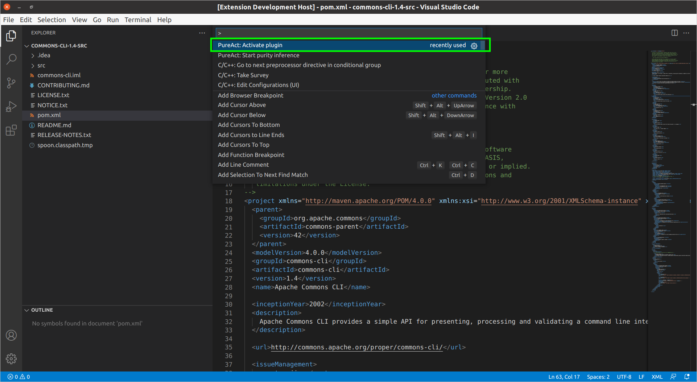
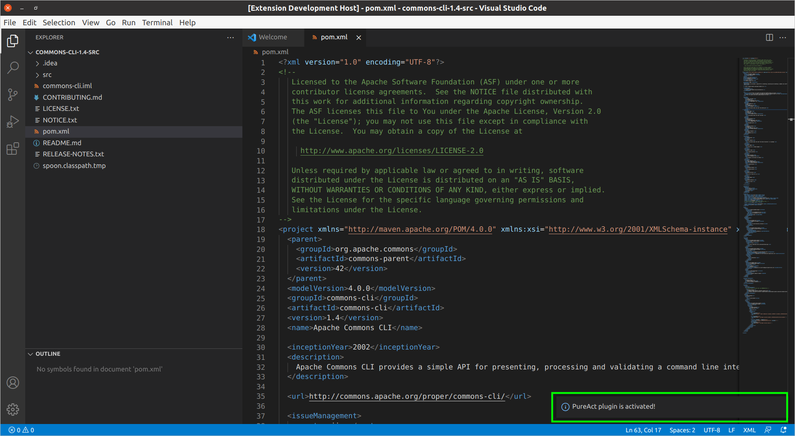
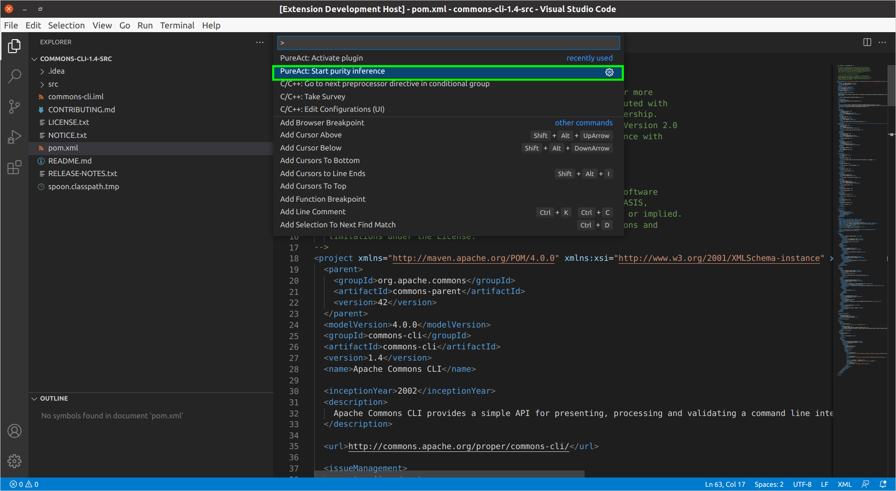
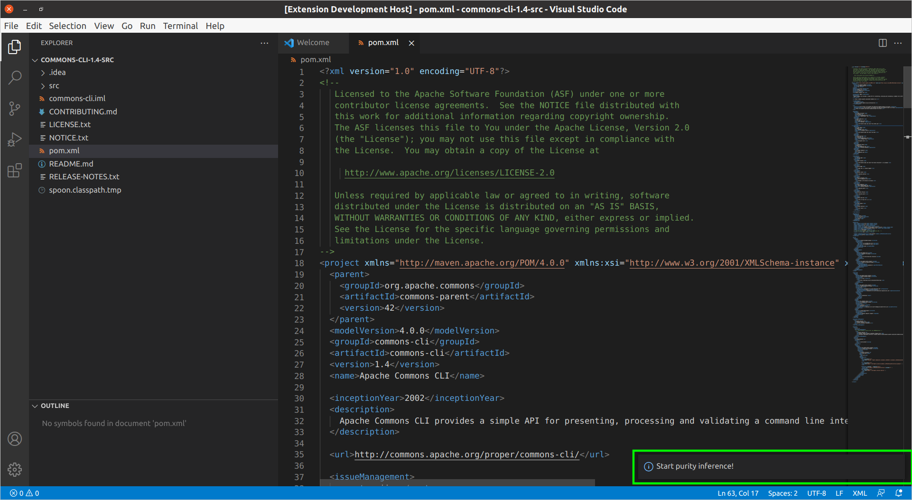
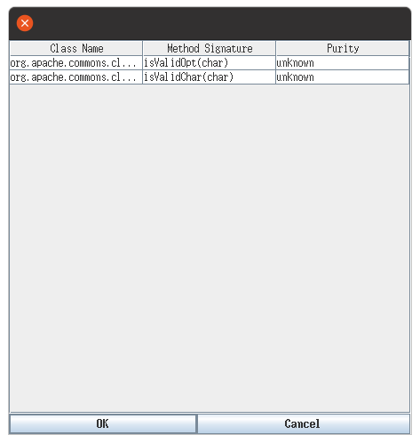
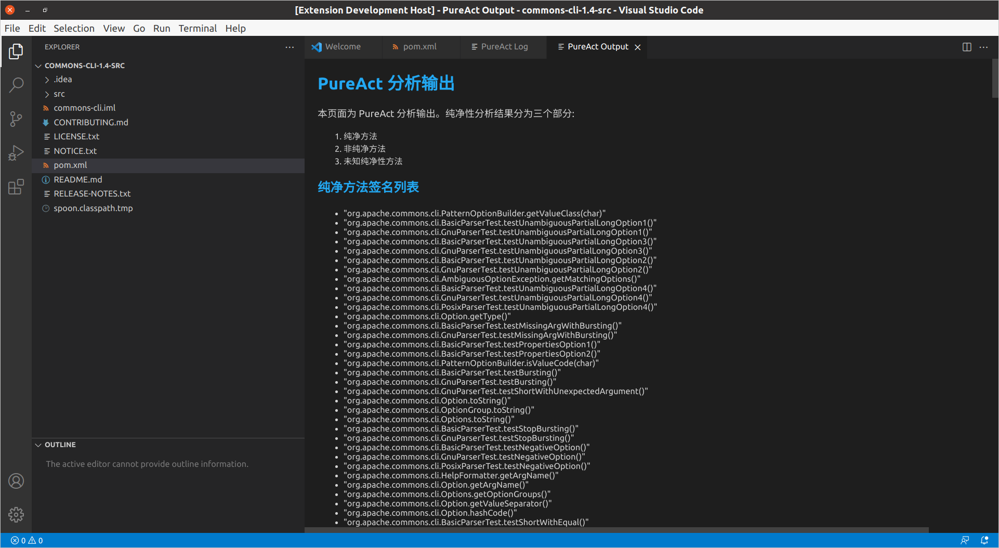
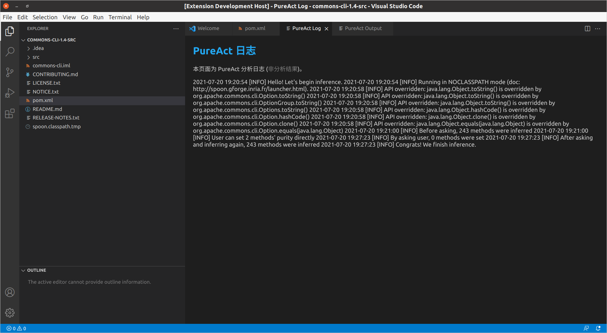

# pureact-plugin

**pureact-plugin** 是一个基于 PureAct 的 VSCode 插件，可用于分析 Java 代码中的方法纯净性。插件输入为 Java 源代码文件，输出为纯净方法、非纯净方法与未知纯净性方法的方法签名。具体上，插件将读取 Maven 工程中的源代码，将其转换成抽象语法树，根据引用不变性进行方法纯净性分析。

本插件由 **[王启凡](https://github.com/QifanWang)** 与 **[玄跻峰](http://jifeng-xuan.com/index_cn.html)** 开发。

## 安装要求

1. 安装 jdk 1.8及以上环境，并添加入 PATH 环境变量。
2. 安装 maven 3.6.3及以上版本，并添加入 PATH 环境变量或 M2_HOME 环境变量。
3. 在 Linux 平台下使用(PureAct在Linux平台下完全测试，部分功能可能与Windwos平台不兼容)。

## 使用说明

安装插件后，使用前需要保证 WorkSpace 只有一个目录，且该目录为 Maven 工程项目的目录，其拥有描述工程信息的 `pom.xml` 文件。

主要有两个步骤：

1. 点击工具栏 `View -> Command Palette` 或使用快捷键 `Ctrl + Shift + P` 后，选择 `PureAct: Activate plugin`。

弹出消息 `PureAct plugin is activated!`，说明插件正常运行。

2. 点击工具栏 `View -> Command Palette` 或使用快捷键 `Ctrl + Shift + P` 后，选择 `PureAct: Start purity inference`。

弹出消息 `Start purity inference!`，说明插件开始分析项目代码。

弹出窗口，用户可设置项目中部分“简单”方法的纯净性以辅助分析。可直接选择 `OK` 跳过。

分析完成后，生成分析结果与分析日志的 Webview 窗口。

## 版本信息

### 0.0.1
初始的简易版本。

